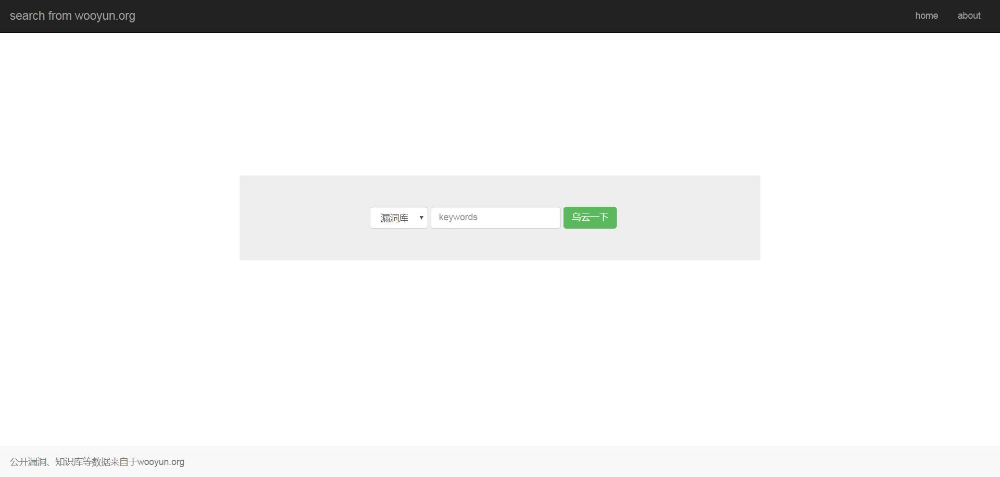
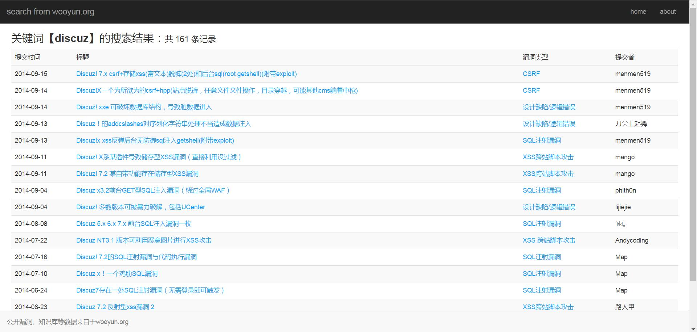

# wooyun_search
**乌云公开漏洞、知识库搜索**





0x00.介绍
--------
+ 灵感来源于hanc00l的github项目[wooyun_public](https://github.com/hanc00l/wooyun_public)

+ wooyun_public基于flask或者tornado，而本项目可以布置在apache、nginx等web服务器上。

+ 如果你有wooyun的静态网页数据，那么我们可以开始了！

+ 整个项目包括两个部分，第一部分是索引，将网页信息存储进数据库;第二部分是搜索，从数据库中查找信息。轻量级，支持进行二次开发。

+ 静态网页网盘链接：
```	
bugs   链接: https://pan.baidu.com/s/1n_kkUaZZxcTEa4-v6sGa9Q 密码: sg98 (20180707)
drops  链接: https://pan.baidu.com/s/1r2Y7rfntwnjglX6HtzDk6w 密码: 738f (20180707)
```

0x01.依赖组件及说明
--------
+ python 2.7和pip

+ python依赖:MySQLdb，lxml(推荐)

+ mysql,php及任意web服务器（php需开启pdo-mysql模块

+ 将本项目放进web服务器目录下，bugs目录下为漏洞库文件，drops目录下为知识库文件。
```
文件说明：
	app_bugs.py                      bugs的索引，依赖lxml
	app_drops.py                     drops的索引，依赖lxml
	index.html                       搜索的主页
	search.php                       执行搜索的页面
	config.php                       php配置文件
	./bugs                           bugs静态文件的目录
	./drops                          drops静态文件的目录
```

0x02.索引配置 
--------
+ app_bugs.py为建立bugs索引的脚本，app_drops为建立drops索引的脚本。

+ 因为python脚本中open()函数打开的文件名不能为中文，建议将drops目录下的中文文件名改为英文(例如，安全运维-xxxx.html=>safe-xxxx.html)

+ python脚本运行前需要修改如下语句，更改参数如主机、端口号、用户名、密码。
```bash
    conn=MySQLdb.connect(host='localhost',port=3306,user='root',passwd='',db='wooyun',charset='utf8')
```

+ 在mysql中建立数据库wooyun，数据表bugs、drops，分别建立字段title,dates,author,type,corp,doc与title,dates,author,type,doc。
```bash
    CREATE DATABASE `wooyun` DEFAULT CHARACTER SET utf8 COLLATE utf8_general_ci;
    create table bugs(title VARCHAR(500),dates DATETIME, author CHAR(255),type CHAR(255),corp CHAR(255),doc VARCHAR(200) PRIMARY KEY);
    create table drops(title VARCHAR(500),dates DATETIME, author CHAR(255),type CHAR(255),doc VARCHAR(200) PRIMARY KEY);
```
+ 注意mysql编码如下，需要为utf-8（character_set_server不为utf-8要修改mysql配置文件
```bash
use wooyun;
show variables like 'character%'; #查看编码
+--------------------------+----------------------------+
| Variable_name            | Value                      |
+--------------------------+----------------------------+
| character_set_client     | utf8                       |
| character_set_connection | utf8                       |
| character_set_database   | utf8                       |
| character_set_filesystem | binary                     |
| character_set_results    | utf8                       |
| character_set_server     | utf8                       |
| character_set_system     | utf8                       |
| character_sets_dir       | /usr/share/mysql/charsets/ |
+--------------------------+----------------------------+
``` 
如果编码错误会报错，比如：
```
Warning: Incorrect string value: '\xE5\xBB\xB6\xE9\x95\xBF...' for column 'title' at row 1
cur.execute("INSERT INTO `drops`(`title`,`dates`,`author`,`type`,`doc`) VALUES(%s,%s,%s,%s,%s)", tmp)
```
在mysql里查看会发现有一堆???

+ 之后就可以建立索引了
```bash
sudo python ./app_bugs.py
sudo python ./app_drops.py
```	
+ bugs数目为40280，drops数目为1264
```bash
use wooyun;
select count(*) from bugs;
select count(*) from drops;
```

0x03.搜索配置 
--------
+ 修改config.php中修改如下语句中参数，分别是主机、端口、用户名、密码与数据库。
```php
$config['host'] = '127.0.0.1';
$config['port'] = '3306';
$config['user'] = 'root';
$config['passwd'] = '';
$config['database'] = 'wooyun'; 
```

+ index.html与search.php样式来自于前端静态资源托管库。f12进入开发者模式，如果样式文件访问不到可以使用本地或cdn的样式(bootstrap3.3.7、jquery3.1.0)。只需要更改两个网页里面的如下内容。

```
<link href="//lib.baomitu.com/twitter-bootstrap/3.3.7/css/bootstrap.min.css" rel="stylesheet" type="text/css">
<script type="text/javascript" src="//lib.baomitu.com/jquery/3.1.0/jquery.min.js"></script>
<script type="text/javascript" src="//lib.baomitu.com/twitter-bootstrap/3.3.7/js/bootstrap.min.js"></script>
```

+ 为了防止因为web服务器配置不正确，导致访问http(s)://example.link/bugs/或者http(s)://example.link/drops/而进入index of页面泄露所有文件，在目录下放置内容为空的index.html即可。

+ linux下由于selinux可能会导致无法连接数据库，可以使用如下命令：
```bash
getenforce   //查看selinux状态
setenforce 0   //暂时关闭selinux
```

0x04.问题
--------

+ drops很奇怪的会都需web目录下的js而不是本身目录里的js，所以drops的页面会有些乱。开发者模式看一下，缺少的js为web目录/static/drops/css与web目录/static/drops/js。新建目录再把drops下的css、js文件夹复制过去即可

0x05.更新日志
--------

+ 2016.10.08更新：上传了bugs.py。由于bugs部分页面(约143条)的author带有js，正则匹配出的信息出错，所以上传了bugs.py用于修正，在app.py后执行，python bugs.py。(2016.11.09已修正，无需执行bugs.py)

+ 2016.10.10更新：重写了search.php和search.css，基本适配了各种浏览器和移动端。

+ 2016.11.09更新：匹配索引将BeautifulSoup换成了lxml，运行速度更快。优化了匹配(感谢@tuola)。

+ 2017.01.01更新：增加了作者搜索，优化了分页逻辑。

+ 2017.3.7更新：重写了前端，优化了php代码。

+ 欢迎反馈问题。可以提问issue也可以通过grt1stnull@gmail.com联系我。后续也会进行其他细节优化。

0x06.后记
--------

+ 本来打算把wooyun_public布置在我的树莓派上，因为一些原因失败，所以萌生了自己搭建的念头

+ 总共搭建了十天，接触了js、bootstarap、beautifulsoup、mysqldb、mysqli和pdo。虽然以前也会css与php，但这是第一次真正写一个动态网页，感觉很棒。

0x07.其他
--------

+ 本程序只用于技术研究和个人使用，程序组件均为开源程序，漏洞和知识库来源于乌云公开漏洞，版权归wooyun.org。

+ 新浪微博:http://weibo.com/grt1st

+ 个人邮箱:grt1stnull@gmail.com
