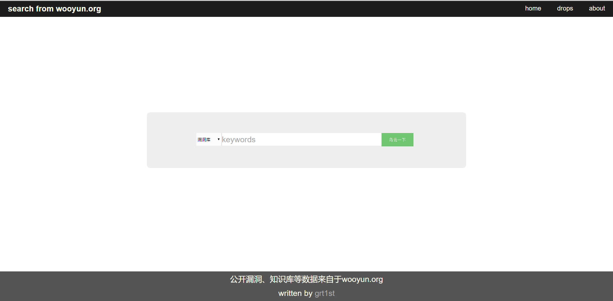
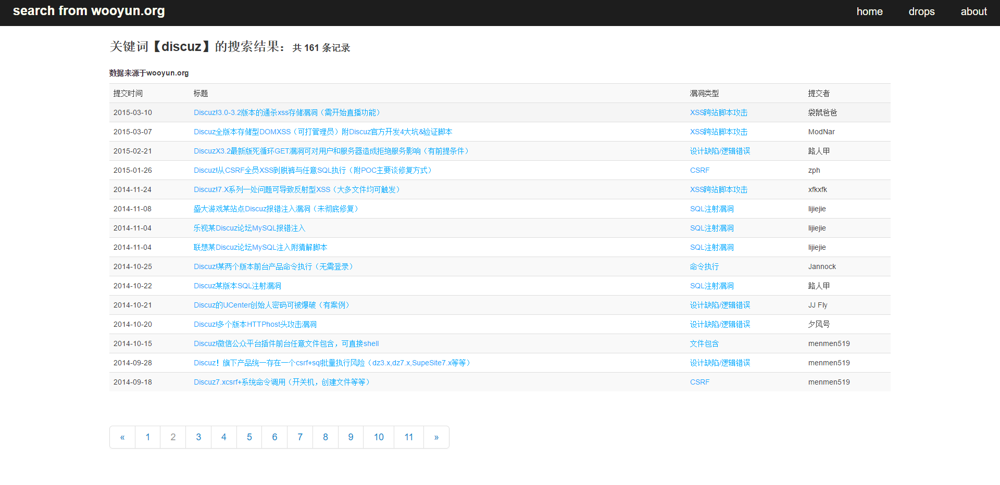
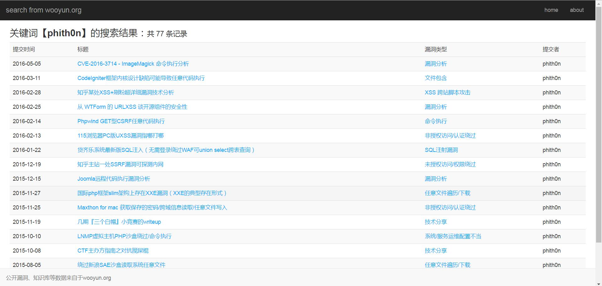

# wooyun_search
**乌云公开漏洞、知识库搜索**





0x00.介绍
--------
+ 灵感来源于hanc00l的github项目[wooyun_public](https://github.com/hanc00l/wooyun_public)

+ wooyun_public基于flask或者tornado，而本项目可以布置在apache、nginx等上

+ 如果你有wooyun的静态网页数据，那么我们可以开始了！

+ 整个项目包括两个部分，第一部分是索引，将网页信息存储进数据库;第二部分是搜索，从数据库中查找信息。支持进行二次开发

+ 资源链接：
	bugs   链接: http://pan.baidu.com/s/1bpC8wkn 密码: q88g(9.25更新)
	drops  链接：http://pan.baidu.com/s/1i5Q8L3f 密码：6apj

0x01.依赖组件及说明
--------
+ python 2.7和pip

+ python依赖:MySQLdb，BeautifulSoup或lxml(推荐)

+ mysql,php及任意web服务器（php需开启mysqli模块

+ 将本项目放进web服务器目录下，bugs目录下为漏洞库文件，drops目录下为知识库文件，bootstrap为样式
```
文件说明：
	app.py                           bugs的索引，依赖beautifulsoup
	app1.py                          drops的索引，依赖beautifulsoup
	app2.py                          bugs的索引，依赖lxml
	app3.py                          drops的索引，依赖lxml
	bugs.py                          2016.11.9更新前对bugs索引的修订
	index.html                       搜索的主页
	search.php                       执行搜索的页面
	./bootstrap                      基本样式
		index.css                    index.html的样式，渣前端
		search.css                   search.php的样式，渣前端
		./js                         bootstrap默认
		./css                        bootstrap默认
		./img                        bootstrap默认
	./bugs                           bugs静态文件的目录
	./drops                          drops静态文件的目录
```

0x02.索引配置 
--------
+ app.py与app2.py为建立bugs索引的脚本，根据已安装的库选择使用哪个，推荐依赖lxml的app2.py，速度更快

+ app1.py与app3.py为建立drops索引的脚本，同样推荐依赖为lxml的app3.py。因为脚本中openu()函数打开的文件名不能为中文，建议将drops目录下的中文文件名改为英文(例如，安全运维-xxxx.html=>safe-xxxx.html)

+ 脚本运行前需要修改如下语句，更改参数如主机、端口号、用户名、密码
```bash
    conn=MySQLdb.connect(host='localhost',port=3306,user='root',passwd='',db='wooyun',charset='utf8')
```
+ 注意mysql编码需要为utf-8
```bash
show variables like 'character%'; #查看编码
```	
+ 在mysql中建立数据库wooyun，数据表bugs、drops，分别建立字段title,dates,author,type,corp,doc与title,dates,author,type，doc
```bash
    create database wooyun；
    create table bugs(title VARCHAR(500),dates DATETIME, author CHAR(255),type CHAR(255),corp CHAR(255),doc VARCHAR(200) PRIMARY KEY);
    create table drops(title VARCHAR(500),dates DATETIME, author CHAR(255),type CHAR(255),doc VARCHAR(200) PRIMARY KEY);
```
+ 之后就可以建立索引了
```bash
sudo python ./app.py
sudo python ./app1.py
```	
+ 建立索引时间较长，正在打包我的wooyun数据库文件，链接后续放出

+ bugs数目为40293，drops数目为1268
```bash
use wooyun;
select count(*) from bugs;
select count(*) from drops;
```

0x03.搜索配置 
--------
+ 修改search.php中修改如下语句中参数，如主机、端口、用户名、密码等
```bash
$db=new mysqli('localhost:3307','root','','wooyun'); 
```

0x04.问题
--------

+ 对页面布局不是很精通，前端有更多可以改进的地方

+ drops很奇怪的会都需web目录下的js而不是本身目录里的js，所以drops的页面会有些乱。开发者模式看一下，缺少的js为web目录/static/drops/css与web目录/static/drops/js。新建目录再把drops下的css、js文件夹复制过去即可

0x05.更新日志
--------

+ 2016.10.08更新：上传了bugs.py。由于bugs部分页面(约143条)的author带有js，正则匹配出的信息出错，所以上传了bugs.py用于修正，在app.py后执行，python bugs.py。(2016.11.09已修正，无需执行bugs.py)

+ 2016.10.10更新：重写了search.php和search.css，基本适配了各种浏览器和移动端。

+ 2016.11.09更新：匹配索引将BeautifulSoup换成了lxml，运行速度更快。优化了匹配(感谢@tuola)。

+ 2017.01.01更新：增加了作者搜索，优化了分页逻辑。

+ 欢迎反馈问题。可以提问issue也可以通过grt1stnull@gmail.com联系我。后续也会进行其他细节优化。

0x06.后记
--------

+ 本来打算把wooyun_public布置在我的树莓派上，因为一些原因失败，所以萌生了自己搭建的念头

+ 总共搭建了十天，接触了js、bootstarap、beautifulsoup、mysqldb、mysqli和pdo。虽然以前也会css与php，但这是第一次真正写一个动态网页，感觉很棒。

0x07.其他
--------

+ 本程序只用于技术研究和个人使用，程序组件均为开源程序，漏洞和知识库来源于乌云公开漏洞，版权归wooyun.org。

+ 新浪微博:http://weibo.com/grt1st

+ 个人邮箱:grt1stnull@gmail.com
